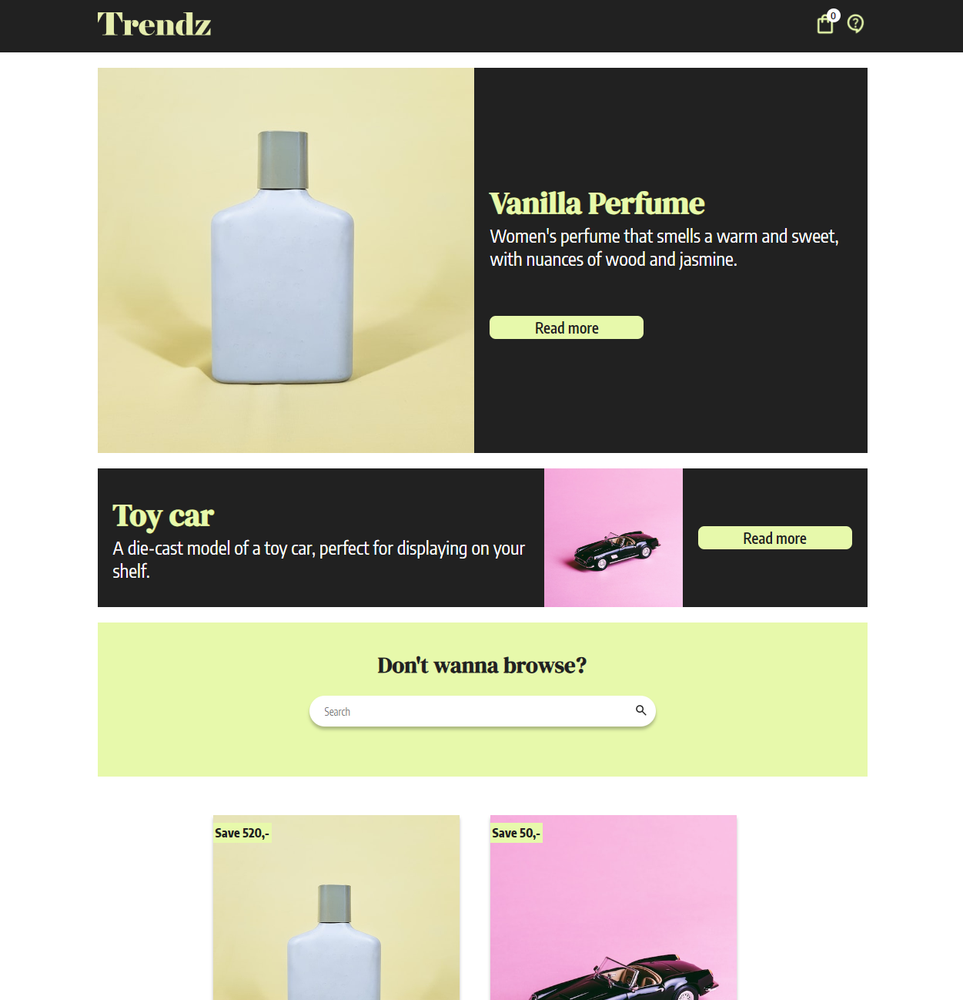

# Trendz - Javascript frameworks



## Description
This project is an eCommerce store built using React. The application allows users to browse products, view individual product details, add items to a cart, and proceed to checkout. It also includes a contact page with form validation. The store uses the API from [Noroff Online Shop](https://v2.api.noroff.dev/online-shop) to fetch product data.

## Features
- **Homepage**: Displays a list of all products with a look-ahead search bar for filtering products.
- **Product Page**: Displays details of a single product, including title, description, image, price, discount, and reviews.
- **Cart Page**: Lists all items in the cart with a total price and a checkout button.
- **Checkout Success Page**: Confirms order success and clears the cart.
- **Contact Page**: Contains a contact form with validation for full name, subject, email, and message body.

## Built With
- React
- React Router
- Styled-components or CSS Modules (for styling)
- JavaScript

## Getting Started
To get a local copy up and running, follow these simple steps:

1. **Clone the repository**:
   ```sh
   git clone https://github.com/Ninuskaninus/javascript-frameworks-CA.git
   ```

2. **install dependencies**:
```sh
npm install
```

3. **Start the development server**:
```sh
npm start
```

## Contact
[LinkedIn](https://www.linkedin.com/in/nina-amdal-a289a719a/)
[Github](https://github.com/Ninuskaninus)

